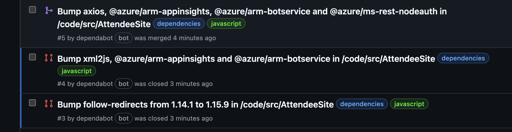

## Step 4: Dependabot version updates を有効にして動かす

_お見事です！_ :partying_face:

依存関係の脆弱性を Dependabot が知らせ、安全なバージョンに更新する pull request を作るところまで自動化できました。あとは pull request を確認してマージするだけで、依存関係のセキュリティ問題に遅れず対応できます。

> [!NOTE]  
> Dependabot が提案した pull request が複数あったことに気づきましたか。マージしたのは **axios** 依存関係のものだけですが、他のものは **Pull requests** の一覧から消えています。axios 依存関係のアップグレードによって他の推移的依存関係にも変更が生じ、削除されたり別のバージョンに更新されたりしたためです。dependency graph に変化があるたびに、Dependabot は既存の pull request を自動で見直し、不要になったものを閉じます。まとめて全部マージせず、Dependabot に任せましょう。 



security updates はアラートの解決を自動化してくれますが、単にバージョンを最新に保ちたい場合はどうでしょうか。Dependabot version updates を使えば、依存関係の新しいバージョンに対する pull request の生成も自動化できます。

**Dependabot version updates とは**: セキュリティアラートに加えて、Dependabot は依存関係の維持にかかる手間も減らせます。依存しているパッケージやアプリケーションの最新リリースに、リポジトリが自動で追随するようにできます。セキュリティアラートと同じように、Dependabot が古くなった依存関係を見つけ、マニフェストを最新バージョンに更新する pull request を作成します。

どう動くか見てみましょう。

### :keyboard: やること 4.1: Dependabot version updates を有効にして動かす

1. **Settings** タブを開き、**Advanced Security**（アカウントによっては **Code security**）を選びます。
1. **Dependabot version updates** を探して **Configure** をクリックすると、内容があらかじめ入ったファイルエディターが開きます。ファイル名は `dependabot.yml` です。
1. `dependabot.yml` には、リポジトリ内の GitHub Actions（`github-actions` パッケージエコシステム）を更新する設定があらかじめ入っています。
1. `dependabot.yml` 設定ファイルを編集して、もう 1 つエントリを追加します。次のようになります。

   ```yaml
   version: 2
   updates:
     - package-ecosystem: "github-actions"
       directory: "/"
       schedule:
         interval: "monthly"
     - package-ecosystem: "nuget"
       directory: "/code/"
       schedule:
         interval: "weekly"
   ```
  
   > 💡 **ヒント:** ファイルは github.com 上で直接編集してコミットできますが、ピリオドキー `.` を押して、ブラウザー内で軽量な VS Code エディターを開くこともできます。

1. 変更を `main` ブランチに直接コミットします。
1. 設定ファイルを更新したので、Mona が作業を確認しています。少し待って、コメントを見てください。進捗と次の Step が投稿されます。

Dependabot version updates が次のように更新を確認するよう設定できました。

- GitHub Actions の更新を月に 1 回確認し、古いものがあれば更新する pull request を作成する。
- .NET パッケージの更新を週に 1 回確認し、古いものがあれば更新する pull request を作成する。既定では月曜日に実行されます。別の曜日に実行するには [schedule.day](https://docs.github.com/en/code-security/dependabot/dependabot-version-updates/configuration-options-for-the-dependabot.yml-file#scheduleday) を参照してください。
